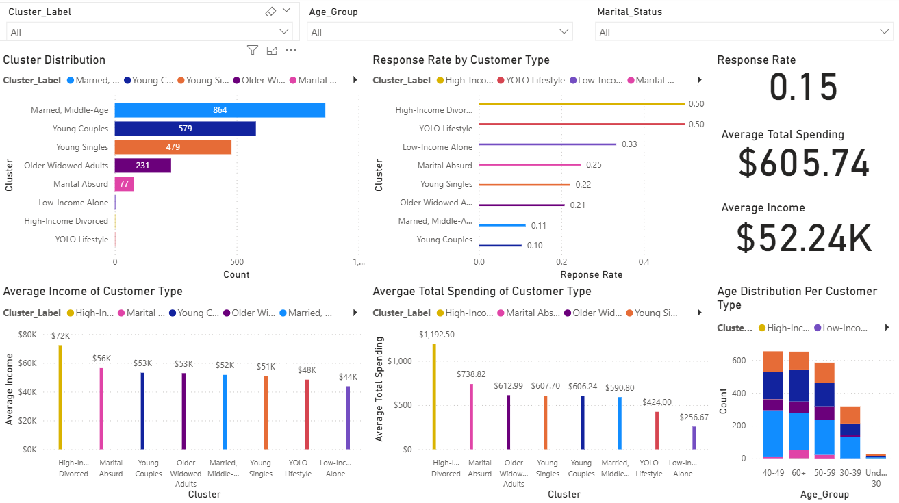

**Python • Power BI • Customer Segmentation**
# Marketing-Campaign-Analysis

**Note**: This project uses the Customer Personality Analysis (https://www.kaggle.com/datasets/imakash3011/customer-personality-analysis?select=marketing_campaign.csv) from Kaggle, which is released under the CC0: Public Domain license.

**Customer segmentation and campaign performance analysis using Python &amp; Power BI**

This project analyzes customer data from a marketing campaign to uncover spending patterns, evaluate past campaign performance, and segment customers for targeted marketing strategies. Using Python for data exploration and clustering, combined with Power BI for interactive dashboards, the analysis delivers actionable business insights that can boost campaign ROI. The main objectives were to understand which customer segments generate the most revenue, compare the performance of past versus current campaigns, build data-driven customer personas through clustering, and provide marketing recommendations based on insights.

The analysis revealed that customers aged 25–31 and 73–80 spend the most on average, with PhD holders emerging as the highest spenders and customers with basic education spending the least. Campaign performance analysis showed that the previous campaign’s acceptance rate was higher than that of the current one, while current campaigns displayed uneven engagement across demographics. K-Means clustering identified eight distinct customer segments, each with unique spending habits, product preferences, and responsiveness to campaigns.

From these insights, the recommendations are clear: target marketing efforts toward high-spending age and education groups, personalize offers for under-engaged yet high-potential clusters, and focus budget allocation on channels that performed well in previous campaigns. The Power BI dashboard offers an executive-level view of these findings, enabling decision-makers to explore the data interactively. This project serves as both a technical and business-focused demonstration of how advanced analytics and visualization can transform raw marketing data into strategies that drive growth.

